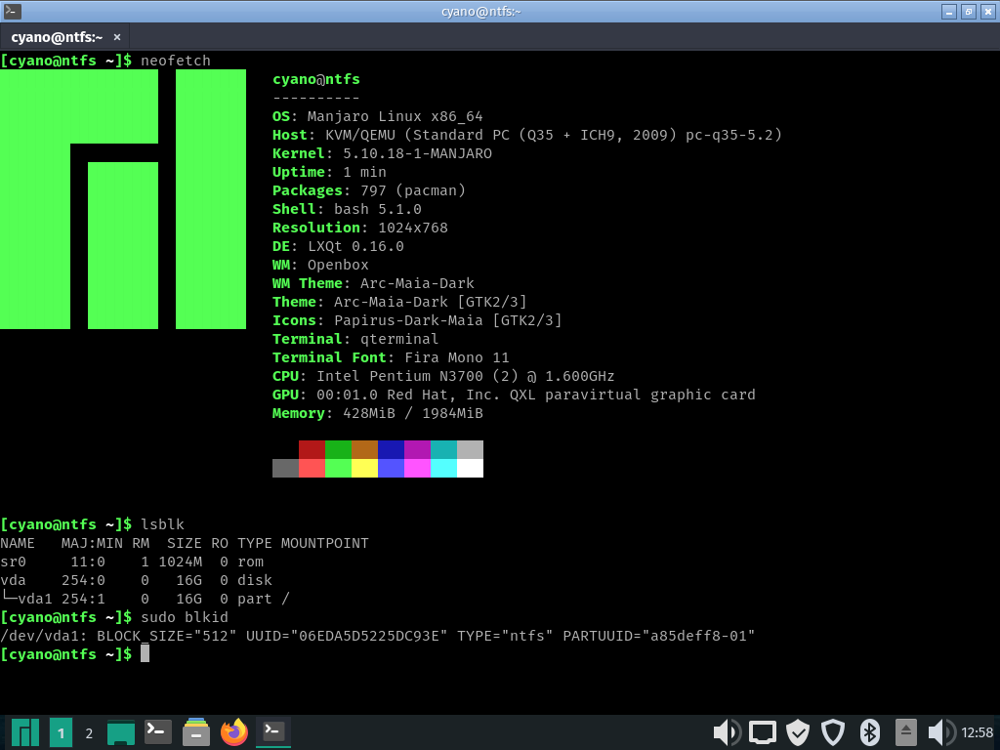

# NTFS as rootfs

Install Linux to an NTFS partition.

This guide focus on partition installtion. For directory installation, [Nikola Pavlica’s guide](https://github.com/nikp123/ntfs-rootfs) may help.

## How NTFS is different from native file systems

### FUSE

* Initramfs is required.
* Initramfs helpers does not handle NTFS properly.

### Permissions

* NTFS-3G can map NTFS permissions to POSIX permissions, if the `permissions` option is (explicitly or implicitly) set on mount.
* Some builds of NTFS-3G may enable `nosuid` by default, and `mount` does not pass `suid` option to `ntfs-3g`.

## Known issue

* Poor performance.
* On shutdown or reboot, the system will halt but not poweroff or reset.

## Arch Linux and Manjaro

### Installation

Arch Linux: follow the ArchWiki [Installation guide](https://wiki.archlinux.org/index.php/Installation_guide) page. Note that the `permissions` option is required when mounting the root partition.

Manjaro: do customised installation like Arch Linux.

* The `manjaro-architect` installer may help.
  * The “architect” iso is not required. You can run it from live media.
* If `manjaro-architect` used, mount the root partition with `permissions` to `/mnt` _manually_.

### `ntfs-3g` package

Arch Linux and Manjaro’s build of NTFS-3G enable `nosuid` by default. The [ntfs-3g-fuse](archpkg-ntfs-3g-fuse/) package works.

### Initramfs

Edit `/etc/mkinitcpio.conf`:

* add `fuse` to the `MODULES` array;
* add `mount.ntfs-3g` to the `BINARIES` array.

Then regenerate initramfs.

### Kernel command line parameters

* Add `rootfstype=ntfs-3g` and `rootflags=permissions` to [kernel command line parameters](https://wiki.archlinux.org/index.php/Kernel_parameters).
* Make sure all required mount options have been add to kernel parameters, and remove root partition from `/etc/fstab` to avoid systemd’s auto remount, which is not supported by NTFS-3G.

## Debian and derivatives

WIP.
